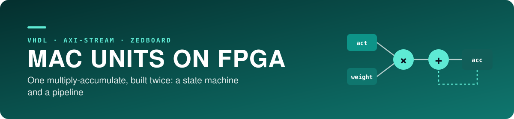
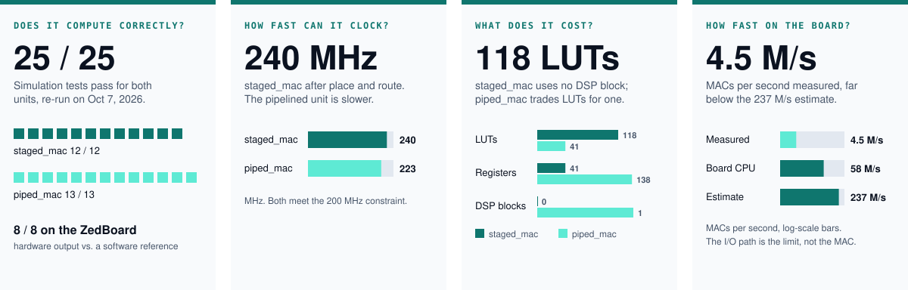
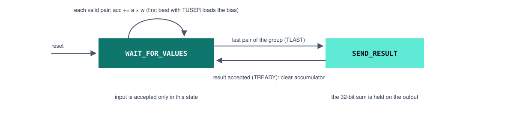

<div align="center">




Iowa State University · CprE 487/587 · Lab 3 · Team 06

[Overview](#overview) · [Where this lab fits](#where-this-lab-fits) · [My role](#my-role) · [Results](#results) · [Limitations](#limitations-and-next-steps)

</div>

---

> **Where it stands — Complete, re-verified on October 7, 2026**  
> Simulation, synthesis and the on-board test were all run again and reproduce every number in the report.  
> Measured throughput is limited by word-at-a-time I/O, not by the MAC itself.



| | |
|---|---|
| Period | September 2026 · re-verified October 7, 2026 |
| Team | 2 — Zach Dixon, Jongwoo Kim |
| My role | Board test suite, performance measurement, verification of simulation and synthesis results |
| Stack | VHDL, Tcl, C++, Vivado/Vitis 2020.1, ZedBoard |
| Deliverables | [Lab 3 report (PDF)](submission/lab3_report_06.pdf) · [Source archive (zip)](submission/lab3_src_06.zip) · [Source folder](submission/lab3_src_06) |
| Next lab | [Lab 5 — hardware integration](https://github.com/devjwk/cpre487lab5) |

## Overview

A convolution output pixel is a sum of products plus a bias. This lab builds the hardware unit that computes it.

- **Problem:** in our C++ model (Lab 2) convolution layers take most of the runtime, and all of that time is multiply-add. Moving the operation to hardware is the first step toward an accelerator.
- **`staged_mac`:** a state-machine design. It receives 8-bit signed (activation, weight) pairs, accumulates their products in a 32-bit register, and outputs the sum when `TLAST` arrives. A first beat marked with `TUSER` loads the bias instead of multiplying.
- **`piped_mac`:** a 4-stage pipelined version of the same function that accepts a new pair every cycle.

## Where this lab fits


## `staged_mac` control



Input is accepted only in `WAIT_FOR_VALUES`, so no pair can arrive while a result is still being sent.

## My role

- Extended the on-board test program (`software_testing/src/main.cpp`) to 8 tests that compare hardware output with a software reference, and added timing with `XTime_GetTime`.
- Re-ran simulation and synthesis for both units and checked every number in our report against the tool output.
- Found that the per-unit folders still held empty templates while the finished designs sat at the top level, and fixed the repository so both locations match.
- Wrote the report sections on test strategy, performance, and the maximum useful pipeline depth.

Zach wrote most of the MAC VHDL and the ILA debug setup.

## What I learned

**Technical**
- AXI-Stream handshaking (`TVALID`/`TREADY`), and why the accumulator must be cleared after each group.
- Sizing the accumulator from the largest kernel: conv2 with N = 800 products sets the worst case.
- Why more pipeline stages stop helping once the critical path sits inside the DSP block.
- Reading Vivado timing and utilization reports.

**Teamwork**
- Verifying a teammate's design with my own test suite instead of assuming it works.
- Keeping a lab-machine working copy and a laptop copy in sync through git.

## Resources used

- Lab 3 handout and the course hardware template
- Xilinx AXI4-Stream documentation, Vivado and Vitis 2020.1
- Our Lab 2 C++ model ([devjwk/487lab2](https://github.com/devjwk/487lab2)) as the reference for expected values

## Results

Every row was produced again on October 7, 2026 on a lab PC with Vivado/Vitis 2020.1 and a ZedBoard; the numbers match the September report exactly. Logs are in [`results/`](results).

| | `staged_mac` | `piped_mac` |
|---|---|---|
| Simulation | 12 / 12 pass | 13 / 13 pass |
| Setup slack (WNS) at 200 MHz | +0.834 ns → 240.0 MHz | +0.511 ns → 222.8 MHz |
| Critical path | `state_reg` → `acc_reg[5]` | inside the DSP48E1 |
| LUTs / registers / DSPs | 118 / 41 / 0 | 41 / 138 / 1 |
| Estimated throughput on conv1 | 236.9 M MACs/s | 222.8 M MACs/s |
| On-board test | 8 / 8 pass | not integrated on the board |

**On the board** (`staged_mac` behind an AXI-Stream FIFO, driven from C++): 8 of 8 tests match a software reference, and one group of 75 MACs takes 16.57 µs, about 4.53 M MACs/s.

- **Pipelining did not raise throughput here.** It removes one idle cycle per group, worth 1.3% at 75 MACs per group, but the extra registers lower the clock by 7%.
- **The measured rate is 50 times below the estimate** because each operand pair is a separate memory-mapped write with polling.

## Limitations and next steps

- Measured throughput is far below the synthesis estimate (about 237 M MACs/s) because each word is written through memory-mapped I/O with polling. A DMA stream is needed to get close to it.
- At 4.5 M MACs/s the unit is slower than the ZedBoard's own CPU (about 58 M MACs/s), so it does not speed up inference yet.
- Operands are fixed at 8 bits. Lab 5 adds 4-bit and 2-bit variants.
- The bias-load path (`TUSER`) is covered in simulation only; the AXI FIFO on the board cannot drive `TUSER`.
- The ILA capture in the report is from September and was not taken again in the re-run.
- Both timing reports show a pulse-width violation (WPWS −0.450 ns) on the 200 MHz test clock, as noted in the report.

## Repository layout

<details>
<summary>Folders, and how to re-run each check</summary>

```
staged_mac/, piped_mac/   VHDL, testbenches, Vivado scripts, timing and utilization reports
software_testing/         on-board test program (src/main.cpp) and Vitis scripts
simple_interface/         block design with the AXI FIFO and ILA, exported hardware (.xsa)
results/                  simulation log from September; logs of the October 7 re-run
submission/               report PDF and source in the layout the handout asks for
report/                   report PDF
lab6_template/            course-provided template for a later lab
```

```bash
# simulation (prints one PASS line per test) and synthesis, from <unit>/vivado
vivado -mode batch -source run_tests.tcl
vivado -mode batch -source run_synth.tcl      # rewrites timing_summary.rpt and utilization.rpt

# on-board test, from software_testing (ZedBoard connected)
./scripts/create_vitis -xsa_path ../simple_interface/vivado/simple_interface/staged_mac_bd_wrapper.xsa
./scripts/flash_vitis                          # Ctrl-C after the output ends

./make_submission.sh                           # rebuilds submission/ from tracked files
```

</details>
