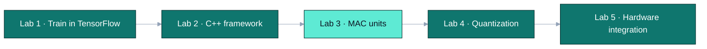
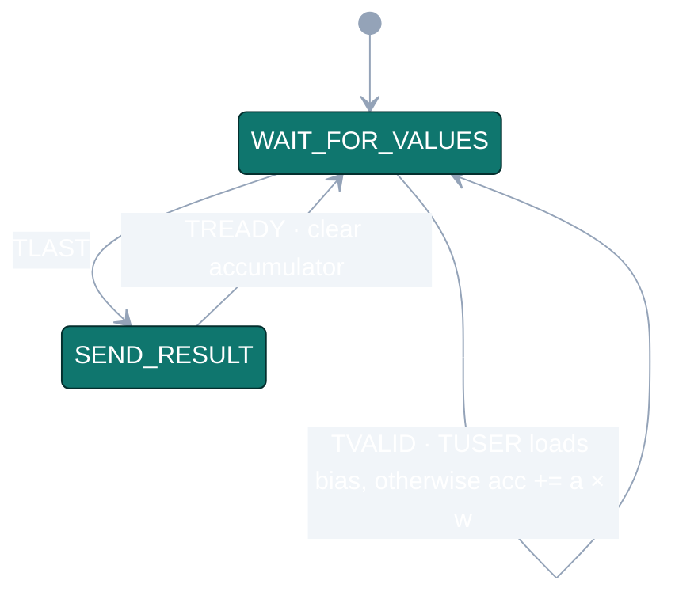

<div align="center">


Iowa State University · CprE 487/587 · Lab 3 · Team 06

[Overview](#overview) · [Where this lab fits](#where-this-lab-fits) · [My role](#my-role) · [Results](#results) · [Limitations](#limitations-and-next-steps)

</div>

---

> **Where it stands — Complete**  
> Both units pass simulation, and `staged_mac` passes all on-board tests against a software reference.  
> Measured throughput is limited by word-at-a-time I/O, not by the MAC itself.

| Simulation | On board | `staged_mac` | Measured |
| :---: | :---: | :---: | :---: |
| **12 / 12 pass** | **8 / 8 pass** | **118 LUT · 0 DSP** | **4.5 M MACs/s** |

| | |
|---|---|
| Period | September 2026 |
| Team | 2 — Zach Dixon, Jongwoo Kim |
| My role | Board test suite, performance measurement, verification of simulation and synthesis results |
| Stack | VHDL, Tcl, C++, Vivado/Vitis 2020.1, ZedBoard |
| Report | [Lab 3 report (PDF)](report/lab3_report_06.pdf) |
| Next lab | [Lab 5 — hardware integration](https://github.com/devjwk/cpre487lab5) |

## Overview

A convolution output pixel is a sum of products plus a bias. This lab builds the hardware unit that computes it.

- **Problem:** in our C++ model (Lab 2) convolution layers take most of the runtime, and all of that time is multiply-add. Moving the operation to hardware is the first step toward an accelerator.
- **`staged_mac`:** a state-machine design. It receives 8-bit signed (activation, weight) pairs, accumulates their products in a 32-bit register, and outputs the sum when `TLAST` arrives. A first beat marked with `TUSER` loads the bias instead of multiplying.
- **`piped_mac`:** a 4-stage pipelined version of the same function that accepts a new pair every cycle.

## Where this lab fits



## `staged_mac` control



Input is accepted only in `WAIT_FOR_VALUES`, so no pair can arrive while a result is still being sent.

## My role

- Extended the on-board test program (`software_testing/src/main.cpp`) to 8 tests that compare hardware output with a software reference, and added timing with `XTime_GetTime`.
- Re-ran simulation and synthesis for both units and checked every number in our report against the tool output.
- Found that the per-unit folders still held empty templates while the finished designs sat at the top level, and fixed the repository so both locations match.
- Wrote the report sections on test strategy, performance, and the maximum useful pipeline depth.

Zach wrote most of the MAC VHDL and the ILA debug setup.

## What I learned

**Technical**
- AXI-Stream handshaking (`TVALID`/`TREADY`), and why the accumulator must be cleared after each group.
- Sizing the accumulator from the largest kernel: conv2 with N = 800 products sets the worst case.
- Why more pipeline stages stop helping once the critical path sits inside the DSP block.
- Reading Vivado timing and utilization reports.

**Teamwork**
- Verifying a teammate's design with my own test suite instead of assuming it works.
- Keeping a lab-machine working copy and a laptop copy in sync through git.

## Resources used

- Lab 3 handout and the course hardware template
- Xilinx AXI4-Stream documentation, Vivado and Vitis 2020.1
- Our Lab 2 C++ model ([devjwk/487lab2](https://github.com/devjwk/487lab2)) as the reference for expected values

## Results

| | `staged_mac` | `piped_mac` |
|---|---|---|
| Simulation | 12/12 tests pass | tests pass |
| On-board tests | 8/8 pass | — |
| LUTs / registers / DSPs | 118 / 41 / 0 | 41 / 138 / 1 |
| Setup slack (WNS) | +0.834 ns | +0.511 ns |

Measured on the board, one group of 75 MACs takes 16.6 µs, about 4.5 M MACs/s.

## Limitations and next steps

- Measured throughput is far below the synthesis estimate (about 237 M MACs/s) because each word is written through memory-mapped I/O with polling. A DMA stream is needed to get close to it.
- At 4.5 M MACs/s the unit is slower than the ZedBoard's own CPU (about 58 M MACs/s), so it does not speed up inference yet.
- Operands are fixed at 8 bits. Lab 5 adds 4-bit and 2-bit variants.

## Repository layout

```
staged_mac/, piped_mac/   VHDL, testbenches, Vivado scripts and reports
software_testing/         on-board test program
simple_interface/         block design with the AXI FIFO and ILA
testresult3.3.1           recorded test output
lab6_template/            course-provided template for a later lab
```
